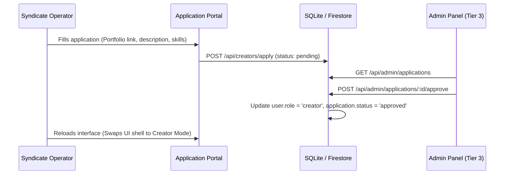

# CLUB 615 // ARCHITECTURAL BLUEPRINTS
> Detailed architectural notes on Authentication, Creator Onboarding, AI Integration, and Semantic Search.

---

## 1. Secure Authentication & Session Architecture
To protect user credentials and prevent session hijacking, we transition from localStorage token management to a secure, production-grade cookie model.

### Technical Implementation:
* **Storage Matrix**: Session tokens (JWTs) are issued by the backend on `/api/auth/login` and stored in an `HttpOnly`, `Secure`, `SameSite=Strict` cookie named `auth_token`. This prevents any client-side JavaScript from reading the token (effectively blocking XSS token theft).
* **Credentials Propagation**: The global frontend interceptor in [main.tsx](file:///C:/Users/shett/antigravity/Untitled/frontend/src/main.tsx) automatically adds `credentials: 'include'` to every `/api/*` request.
* **Route Guards**: Dashboard and admin routes are wrapped in an `AuthenticatedRoute` wrapper in [App.tsx](file:///C:/Users/shett/antigravity/Untitled/frontend/src/App.tsx). If the auth state is unauthenticated:
  1. The router intercepts the navigation and redirects to `/home`.
  2. The frontend triggers the login modal via `useAuth().login()`.

---

## 2. Creator Onboarding & Role Promotion Matrix
Creators must apply to join the Syndicate to sell assets in the Vault or claim Forge commissions.

### Database Schema Updates:
* **User Record Extension**: Add `roles: Array<"buyer" | "creator" | "admin">` to the database.
* **Onboarding Form**: `/home/apply` collects applicant's portfolio URL, primary specialty (3D, 2D, sound, UI), and biography.
* **Verification Loop**: Admin dashboard `/home/admin` lists all pending approvals. Promoting a user updates the roles array in the database and invalidates old sessions, forcing a role claims refresh.

---

## 3. Web AI Assistant (Sheru) & AI Logic Integration
Integrating Gemini API (via Firebase AI Logic or directly on the backend) to power smart operator tools.

### Key Use Cases:
1. **Interactive Lore Guide**: Sheru acts as a smart chat assistant capable of answering questions about the Walled Garden lore, the platform features, and active bounties.
2. **Context-Aware Recommendations**: When viewing a creator's portfolio, Sheru can suggest specific project requirements or outline a suggested bid structure based on historical contract data.
3. **Automated Code / Asset Validation**: When creators upload scripts or templates to the Vault, backend AI scans the file for basic syntax correctness, malware patterns, and metadata suggestions.

---

## 4. Semantic Marketplace AI Search
Standard keyword search fails when users describe their abstract aesthetic needs. We implement semantic/multimodal search.

### Setup & Workflow:
1. **Embedding Generator**: When an asset is uploaded to the Vault, the backend triggers a pipeline:
   - Formulates a description string (Title + Description + Tags).
   - Generates a vector embedding (e.g., using `text-embedding-004` via Gemini API).
   - Stores the vector embedding alongside the asset metadata.
2. **Search Pipeline**:
   - User enters a query: *"gritty dark cyberpunk layout for terminal"*
   - The search endpoint (`/api/marketplace/search`) converts the text query into a vector query embedding.
   - Computes cosine similarity or performs a Firestore Vector Search to retrieve the top $K$ matching relics.
   - Returns results ranked by similarity score, allowing natural language discovery.

---

## 5. Deployment & Git Integration
* **Git Commit**: Commit all recent changes, grid layouts, mobile menu redesigns, and secure cookie updates.
* **Vercel Hook**: Push to the connected GitHub repository to trigger the automated Vercel preview/production pipeline.
